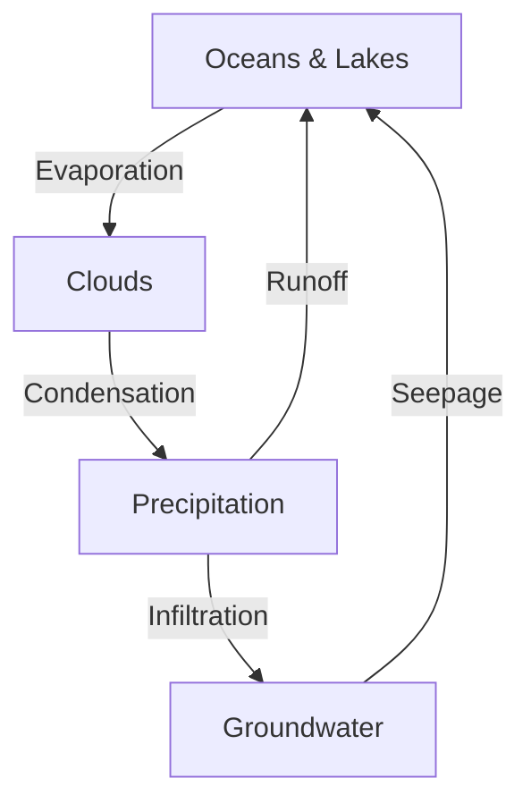
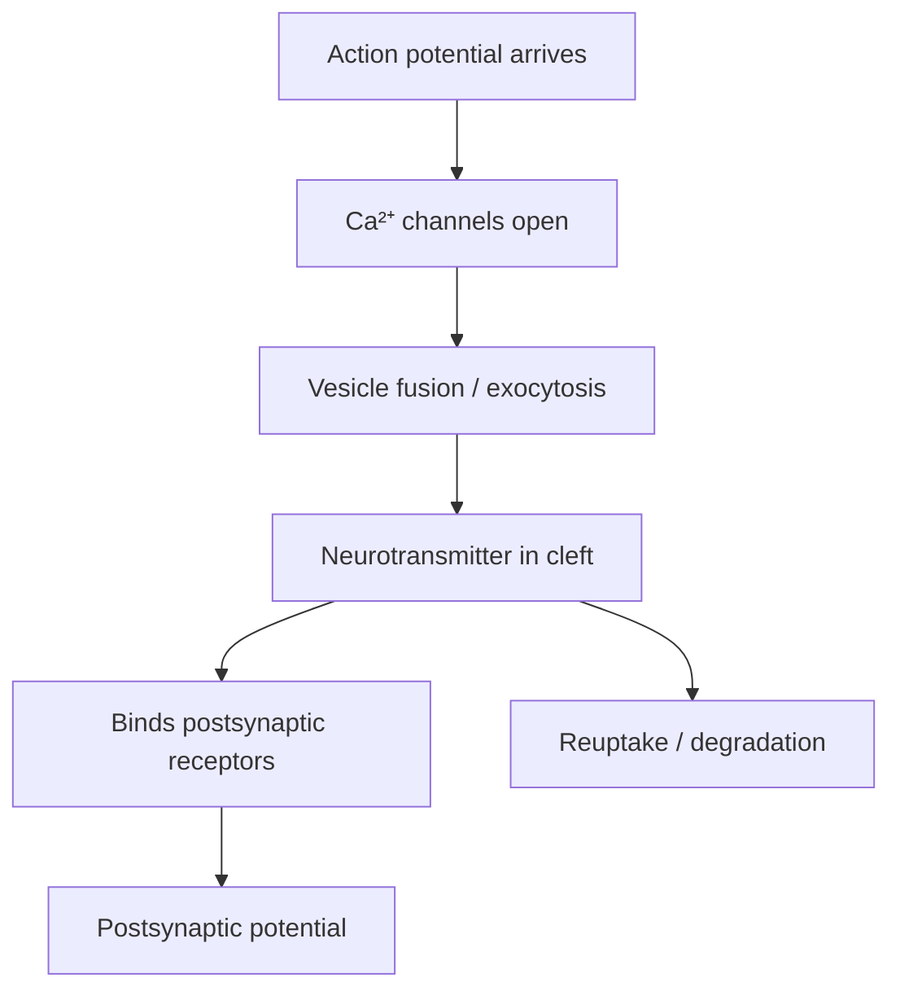

# Edumark — Format Specification v2.0

> Educational authoring format based on extended Markdown.
> Designed for any discipline and educational level.
> File extension: `.edm`

---

## Core principle

> An `.edm` file describes **what** the content is, never **how** it looks.
> Style, position, and layout are the sole responsibility of the decoder.
> Block attributes are purely semantic (type, id, title, answer, etc.).

---

## 1. Base: CommonMark

Edumark inherits all [CommonMark](https://commonmark.org/) syntax without modifications. Everything valid in CommonMark is valid in `.edm`:

- Headings (`#`, `##`, etc.)
- Paragraphs, emphasis (`*italic*`, `**bold**`)
- Ordered and unordered lists
- Links and inline images (``)
- Code blocks (with ` ``` `)
- Tables (GFM extension)
- Blockquotes (`>`)
- Horizontal rules (`---`)

What Edumark adds are **pedagogical blocks** and **composition mechanisms** that don't exist in CommonMark.

---

## 2. Document metadata (YAML frontmatter)

Each `.edm` file may optionally begin with a YAML block delimited by `---`. Fields are free-form and serve as machine-readable metadata for tooling (indexing, book composition, etc.).

```yaml
---
title: "Chapter or document title"
author: "Author name"
version: 1.0
date: 2026-01
---
```

The frontmatter is **not** rendered as visible content. For the document's visual header (cover, title page), use the `:::hero` block (§3.1).

---

## 3. Pedagogical blocks

All blocks follow the fenced directives syntax:

```
:::type attribute="value"
Content in standard Markdown.
:::
```

### General rules

- Blocks open with `:::type` and close with `:::` on its own line.
- Attributes are optional and purely semantic: `id`, `title`, `type`, `answer`, etc.
- Inner content accepts full standard Markdown.
- Blocks may nest when semantically meaningful (e.g., `:::solution` inside `:::exercise`).
- Any `id` attribute must be unique within the document and serves as an anchor for cross-references.

### Attribute syntax

```
:::type                              ← no attributes
:::type id="my-id"                   ← one attribute
:::type id="my-id" title="Title"     ← multiple attributes
```

Values go in double quotes. Attribute names are always lowercase with no spaces (use hyphens: `key-concept`).

---

### 3.1 `:::hero`

Document cover / header block. Introduces the chapter or document using `key: value` fields on separate lines (same internal format as `:::image`). An optional bulleted list at the end defines the topic index.

```
:::hero
title: "Kinematics: The Study of Motion"
author: "Edumark Example"
version: 1.0
date: 2026-03
subject: "General Physics"
level: "Undergraduate"
unit: "I — Mechanics"
- Position and displacement
- Average and instantaneous velocity
- Acceleration
- Uniform rectilinear motion (URM)
- Free fall
:::
```

Typically placed at the very beginning of the document, before any heading or `:::objective`.

**Optional internal fields:** `title`, `author`, `version`, `date`, `subject`, `level`, `unit`
**Optional content:** A bulleted list of topics after the fields.
**Optional attributes:** `id`

---

### 3.2 `:::objective`

Learning objectives at the beginning of a chapter or section.

```
:::objective
By the end of this topic the student will be able to:
- Describe X.
- Identify Y.
- Compare A with B.
:::
```

**Optional attributes:** `id`

---

### 3.3 `:::definition`

Defines one or more technical terms. Internal format uses `**Term** | Definition` to separate term from definition.

Single term:
```
:::definition id="photosynthesis"
**Photosynthesis** | The process by which plants convert sunlight into chemical energy.
:::
```

Multiple terms:
```
:::definition multiple
**Mitosis** | Cell division that produces two identical daughter cells.
**Meiosis** | Cell division that produces four haploid cells.
:::
```

**Optional attributes:** `id`, `multiple` (flag, no value)

---

### 3.4 `:::key-concept`

Highlights a fundamental concept the student must retain.

```
:::key-concept id="ohms-law"
Electric current is directly proportional to voltage and inversely proportional to resistance: I = V/R.
:::
```

**Optional attributes:** `id`

---

### 3.5 `:::note`

Supplementary information, trivia, or useful clarifications.

```
:::note
The word "algorithm" comes from the name of the Persian mathematician al-Khwarizmi (9th century).
:::
```

**Optional attributes:** `id`

---

### 3.6 `:::warning`

Flags common conceptual errors, frequent confusions, or important warnings.

```
:::warning
Do not confuse **mass** with **weight**. Mass is an intrinsic property of the object (kg); weight is the gravitational force acting on it (N).
:::
```

**Optional attributes:** `id`

---

### 3.7 `:::example`

A practical case, worked example, or concrete application of a concept.

```
:::example title="Average speed calculation"
A car travels 150 km in 2 hours.
Average speed = 150 km / 2 h = 75 km/h.
:::
```

**Optional attributes:** `id`, `title`

---

### 3.8 `:::exercise`

Activity or problem for the student to solve. May contain a nested `:::solution` block.

```
:::exercise id="ex-01" title="Ohm's Law"
If a circuit has a resistance of 10 Ω and a voltage of 5 V, what is the current?

:::solution
I = V / R = 5 V / 10 Ω = 0.5 A
:::
:::
```

**Optional attributes:** `id`, `title`

---

### 3.9 `:::application`

Connects theoretical content with its practical or professional relevance. Replaces discipline-specific blocks (like "clinical" in medicine) with a generic block applicable to any field.

```
:::application title="Suspension bridges"
Cable tension calculation is fundamental in suspension bridge design.
The Golden Gate Bridge uses steel cables with tension calculated using
the same statics equations studied in this chapter.
:::
```

```
:::application title="Cerebral ischemia"
Neurons tolerate only 4–6 minutes of anoxia before irreversible death.
This explains the urgency of thrombolytic treatment in stroke.
:::
```

**Optional attributes:** `id`, `title`

---

### 3.10 `:::comparison`

Compares two or more concepts, structures, or entities using a table.

```
:::comparison title="DNA vs. RNA"
| Feature | DNA | RNA |
|---|---|---|
| Sugar | Deoxyribose | Ribose |
| Bases | A, T, G, C | A, U, G, C |
| Strands | Double helix | Single strand |
| Function | Storage | Gene expression |
:::
```

**Optional attributes:** `id`, `title`

---

### 3.11 `:::diagram`

Describes a figure or diagram. A diagram block can contain:

1. **Text description only** — a human-readable description of what the diagram should show. The decoder may use it as a placeholder, pass it to an AI, or display it as-is.
2. **Code block only** — a fenced code block in a diagram language. The decoder uses [Kroki](https://kroki.io) to render diagrams, so any Kroki-supported language is valid. SVG is also accepted and rendered directly without Kroki.
3. **Both** (recommended) — a text description as fallback plus a code block. The decoder renders the code if it can; otherwise it falls back to the text description.

The text description always goes first, before any code block. The diagram language is declared in the code fence (` ```mermaid `, ` ```d2 `, ` ```dot `, ` ```plantuml `, ` ```svg `, etc.).

#### Supported diagram languages (via Kroki)

`actdiag`, `blockdiag`, `bpmn`, `bytefield`, `c4`, `d2`, `dbml`, `ditaa`, `erd`, `excalidraw`, `graphviz` (or `dot`), `mermaid`, `nomnoml`, `nwdiag`, `packetdiag`, `pikchr`, `plantuml`, `rackdiag`, `seqdiag`, `structurizr`, `svgbob`, `symbolator`, `tikz`, `umlet`, `vega`, `vega-lite`, `wavedrom`, `wireviz`

Additionally, `svg` is always supported (rendered directly by the decoder, not via Kroki).

Text-only (simplest):
```
:::diagram id="fig-water-cycle" title="The water cycle"
Circular diagram showing:
- Evaporation from oceans and lakes
- Condensation into clouds
- Precipitation (rain, snow)
- Runoff and infiltration
- Arrows indicating cyclic flow
:::
```

Code-only:
````
:::diagram id="fig-water-cycle" title="The water cycle"

:::
````

Both (recommended):
````
:::diagram id="fig-synapse" title="Chemical synapse sequence"
Flowchart showing the steps of chemical synaptic transmission:
1. Action potential arrives at presynaptic terminal
2. Ca²⁺ channels open
3. Vesicles fuse with membrane (exocytosis)
4. Neurotransmitter crosses synaptic cleft
5. Binds to postsynaptic receptors
6. Postsynaptic potential generated
7. Neurotransmitter removed


:::
````

SVG (for precise visual diagrams):
````
:::diagram id="fig-inclined-plane" title="Forces on an inclined plane"
Free body diagram of a block on a frictionless inclined plane at angle θ.
Three forces act on the block: weight (W) pointing straight down,
normal force (N) perpendicular to the surface, and the weight
component along the plane (W·sin θ) pointing down the slope.

```svg
<svg viewBox="0 0 300 220" xmlns="http://www.w3.org/2000/svg">
  <!-- inclined plane -->
  <polygon points="20,200 280,200 280,60" fill="none" stroke="currentColor" stroke-width="2"/>

  <!-- angle arc and label -->
  <path d="M 240,200 A 40,40 0 0,0 259,183" fill="none" stroke="currentColor" stroke-width="1.5"/>
  <text x="232" y="192" font-size="14" fill="currentColor">θ</text>

  <!-- block on the slope -->
  <rect x="168" y="108" width="40" height="40" fill="none" stroke="currentColor" stroke-width="2"
        transform="rotate(-26.57 188 128)"/>

  <!-- weight arrow (W) — straight down -->
  <line x1="188" y1="140" x2="188" y2="200" stroke="currentColor" stroke-width="2"
        marker-end="url(#arrow)"/>
  <text x="194" y="178" font-size="14" font-weight="bold" fill="currentColor">W</text>

  <!-- normal force arrow (N) — perpendicular to surface -->
  <line x1="188" y1="128" x2="163" y2="68" stroke="currentColor" stroke-width="2"
        marker-end="url(#arrow)"/>
  <text x="146" y="72" font-size="14" font-weight="bold" fill="currentColor">N</text>

  <!-- component along the plane (W·sin θ) — down the slope -->
  <line x1="188" y1="140" x2="232" y2="162" stroke="currentColor" stroke-width="2"
        stroke-dasharray="6 3" marker-end="url(#arrow)"/>
  <text x="222" y="180" font-size="12" fill="currentColor">W·sin θ</text>

  <!-- arrowhead marker -->
  <defs>
    <marker id="arrow" viewBox="0 0 10 10" refX="10" refY="5"
            markerWidth="8" markerHeight="8" orient="auto-start-reverse">
      <path d="M 0 0 L 10 5 L 0 10 z" fill="currentColor"/>
    </marker>
  </defs>
</svg>
```
:::
````

#### SVG guidelines

When using SVG inside `:::diagram`:

- Always include `viewBox` — never use fixed `width`/`height` (the decoder controls sizing).
- Use `currentColor` for strokes and fills — this lets the decoder's theme control colors.
- Keep the SVG self-contained: no external references (`<use href="...">`, `<image href="...">`).
- No inline `<style>` blocks or `style` attributes — use SVG presentation attributes (`stroke`, `fill`, `stroke-width`, etc.) directly on elements.
- Prefer simple, clean shapes — SVG in `.edm` is for schematic/educational diagrams, not complex illustrations.

The decoder chooses what to render. The `.edm` file never specifies how — it only provides the semantic content and optionally a machine-readable diagram source.

**Required attributes:** `id`, `title`

---

### 3.12 `:::image`

Inserts an image with descriptive metadata. Internal format uses `key: value` pairs on separate lines.

```
:::image id="fig-cell"
file: animal_cell.jpg
title: "Typical animal cell"
description: "Electron micrograph of an animal cell showing nucleus, mitochondria, and endoplasmic reticulum."
source: "Alberts et al., Molecular Biology of the Cell, 6th ed."
alt: "Animal cell with visible organelles"
:::
```

**Required attributes:** `id`
**Internal fields:** `file`, `title`, `description`, `source`, `alt`

---

### 3.13 `:::question`

Study question or self-assessment. The `type` attribute indicates the modality.

Options in choice questions use GIFT-inspired markers:
- `=` prefix → correct answer
- `~` prefix → incorrect answer (distractor)
- `#` after an option → feedback for that option (optional)

The decoder decides the presentation: in interactive HTML it can show a clickable quiz with feedback on selection; in PDF it can create interactive form fields; in print it can put answers in a separate answer key (inverted, at the end, etc.).

#### Multiple choice (single correct answer)

```
:::question type="choice" id="q-force"
What is the SI unit for force?

~ Joule # That's the unit of energy
~ Watt # That's the unit of power
= Newton # Correct — force = mass × acceleration
~ Pascal # That's the unit of pressure
:::
```

#### Multiple choice (multiple correct answers)

```
:::question type="choice" id="q-vectors"
Which of the following are vector quantities? (Select all that apply)

= Velocity # Correct — has magnitude and direction
~ Mass # Mass is a scalar
= Acceleration # Correct — has magnitude and direction
~ Temperature # Temperature is a scalar
= Force # Correct — has magnitude and direction
:::
```

#### True or false

```
:::question type="true-false" id="q-light"
The speed of light in a vacuum depends on the frequency of the wave.

= false # The speed of light in a vacuum is constant (c ≈ 3×10⁸ m/s) regardless of frequency
:::
```

#### Open-ended (development)

```
:::question type="open"
Why are metals good conductors of electricity?
:::
```

Open-ended questions may optionally include a model answer using `= answer text`:

```
:::question type="open" id="q-metals"
Why are metals good conductors of electricity?

= Metals have a "sea" of delocalized electrons in their outer shells that are free to move through the crystalline lattice. When a potential difference is applied, these electrons flow as electric current. The metallic bond structure allows this free movement, which is why metals have low electrical resistance.
:::
```

#### Applied case

```
:::question type="case" id="q-brake"
A traffic accident investigator finds 40 m skid marks on dry asphalt.
The friction coefficient is 0.7 (deceleration ≈ 6.86 m/s²).
The speed limit is 60 km/h.

a) What was the vehicle's speed before braking?
b) Was it exceeding the speed limit?

= a) Using v² = 2·a·d → v = √(2 × 6.86 × 40) = 23.4 m/s = 84.3 km/h
= b) Yes, the vehicle was traveling at 84.3 km/h, exceeding the 60 km/h limit by 24.3 km/h.
:::
```

#### Summary of question markers

| Marker | Meaning |
|---|---|
| `=` | Correct answer (choice) or model answer (open/case) |
| `~` | Incorrect answer / distractor |
| `#` | Feedback for the preceding option (shown after answering) |

**Required attributes:** `type` (values: `open`, `choice`, `case`, `true-false`)
**Optional attributes:** `id`

The decoder is responsible for all presentation logic: hiding answers in student mode, revealing them on interaction, creating answer keys for print, building interactive quizzes in HTML, etc.

---

### 3.14 `:::mnemonic`

Mnemonic device to aid memorization.

```
:::mnemonic
**Order of planets → My Very Educated Mother Just Served Us Nachos**
- **M**ercury
- **V**enus
- **E**arth
- **M**ars
- **J**upiter
- **S**aturn
- **U**ranus
- **N**eptune
:::
```

**Optional attributes:** `id`

---

### 3.15 `:::history`

Historical context, anecdotes, or the story of a relevant discovery.

```
:::history title="The discovery of penicillin" characters="Alexander Fleming" year="1928"
In September 1928, Alexander Fleming returned from vacation to his laboratory
at St. Mary's Hospital in London. He found that a mold had contaminated
one of his *Staphylococcus* culture plates. Around the mold, the bacteria
had died. That "accident" led to the discovery of the first antibiotic
and transformed medicine forever.
:::
```

**Optional attributes:** `id`, `title`, `characters`, `year`

---

### 3.16 `:::summary`

Synthesis at the end of a topic, section, or chapter.

```
:::summary
- Essential point 1.
- Essential point 2.
- Essential point 3.
:::
```

**Optional attributes:** `id`

---

### 3.17 `:::reference`

Bibliographic sources for the chapter or section.

```
:::reference
- Author A. *Book title*. Edition. Publisher; Year.
- Author B, Author C. *Another book*. Edition. Publisher; Year.
:::
```

**Optional attributes:** `id`

---

### 3.18 `:::aside`

Supplementary content that doesn't fit other categories: fun facts, additional info, cultural context, etc.

```
:::aside title="Did you know?"
The number π has been calculated to over 100 trillion digits,
but for most engineering applications, 15 decimal places suffice.
:::
```

**Optional attributes:** `id`, `title`

---

### 3.19 `:::math`

Display math block. The author writes natural Unicode notation — the decoder converts it to rendered formulas.

```
:::math
v = v₀ + a·t
x = x₀ + v₀·t + ½·a·t²
v² = v₀² + 2·a·(x − x₀)
:::
```

Each non-empty line inside `:::math` is treated as a separate equation and rendered as display math (centered).

**Optional attributes:** `id`

### 3.20 Inline math: `m{...}`

For formulas within running text, wrap them in `m{...}`:

```
The velocity is m{v̄ = Δx/Δt} and is measured in m/s.
```

The author writes human-readable Unicode. The decoder is responsible for rendering it as proper mathematical notation. Supported conventions:

#### Subscripts and superscripts

| Author writes | Meaning |
|---|---|
| `v₀`, `x₁`, `t₂` … `₉` | Subscript digits |
| `ₙ`, `ₘ`, `ᵢ`, `ⱼ`, `ₓ` | Subscript letters |
| `v_{max}`, `x_{fi}` | Multi-character subscripts (underscore + word) |
| `t²`, `v³`, `x⁴` | Superscript digits |
| `ⁿ` | Superscript letter |

#### Greek letters

| Author writes | Meaning |
|---|---|
| `Δ` | Delta (uppercase) |
| `α`, `β`, `γ`, `θ`, `λ`, `μ` | Common lowercase Greek |
| `π`, `σ`, `ω`, `φ`, `ε`, `τ`, `ρ` | More lowercase Greek |

The author writes standard Unicode Greek characters. The decoder maps them to the rendering engine's equivalents.

#### Operators and symbols

| Author writes | Meaning |
|---|---|
| `a·t`, `F×d` | Multiplication (middle dot or ×) |
| `÷` | Division |
| `±`, `∓` | Plus-minus, minus-plus |
| `≈`, `≠`, `≤`, `≥` | Comparison operators |
| `∝` | Proportional to |
| `∞` | Infinity |
| `→`, `←`, `⇒` | Arrows |
| `∈` | Element of |
| `∑`, `∫`, `∂` | Sum, integral, partial derivative |

#### Fractions, roots, and special notation

| Author writes | Meaning |
|---|---|
| `Δx/Δt` | Simple fraction (word/word) |
| `(a+b)/(c-d)` | Fraction with grouped numerator/denominator |
| `½`, `⅓`, `¼`, `⅔`, `¾` | Vulgar fractions |
| `√(2·g·h)`, `√2` | Square root |
| `v̄`, `x̄` | Variable with bar (combining character) |
| `lím` | Limit (Spanish) |

#### Units

When a number is followed by a unit (`m/s`, `km/h`, `kg`, `N`, `V`, `Ω`, etc.), the decoder renders the unit in upright text (not italic) as per mathematical convention.

The format **never** uses LaTeX syntax. No `\frac`, `\text`, `\sqrt`, or `$$`. The `.edm` file stays human-readable at all times. The decoder translates Unicode conventions to whatever rendering engine it uses (KaTeX, MathJax, native, etc.).

---

## 4. Cross-references

### 4.1 IDs

Any block may have an `id` attribute that uniquely identifies it within the document:

```
:::definition id="entropy"
**Entropy** | A measure of the disorder of a thermodynamic system.
:::
```

Markdown headings generate automatic IDs based on their text (as in CommonMark/GFM).

### 4.2 Reference syntax

To reference a block or heading from anywhere in the text:

```
ref{id}          → reference to a block by its id
ref{id text}     → reference with custom text
```

Examples:

```
As defined in ref{entropy}, disorder tends to increase.
See the ref{fig-water-cycle Water cycle figure}.
Solve ref{ex-01 the exercise on Ohm's Law}.
```

The decoder decides how to render the reference: as a hyperlink, figure number, text with page number, etc. **Automatic numbering** (Figure 1, Table 2, Exercise 3) is the decoder's responsibility.

### 4.3 Cross-file references

When a book is composed of multiple `.edm` files, cross-file references use the relative path as prefix:

```
ref{ch02.edm#block-id}
ref{ch02.edm#block-id custom text}
```

---

## 5. Includes (document composition)

A book is composed from multiple `.edm` files using the `::include` directive:

```
::include file="path/to/file.edm"
```

Note that `::include` uses **two** colons (not three), since it doesn't delimit content.

### Root book file

The root file defines the book structure in its frontmatter and/or with includes:

```yaml
---
title: "Fundamentals of Physics"
author: "María García"
edition: 1
---
```

```
# Fundamentals of Physics

::include file="ch01_kinematics.edm"
::include file="ch02_dynamics.edm"
::include file="ch03_energy.edm"
::include file="appendix_formulas.edm"
```

Includes resolve recursively (an included file may include others). The decoder must detect and reject circular inclusions.

---

## 6. Conditional content

### 6.1 `:::teacher-only`

Wraps content that should only appear in the teacher's version. The decoder includes or omits it based on compilation mode.

```
:::teacher-only
The midterm exam answers are:
1. c) Newton
2. a) True
3. I = V/R = 0.5 A
:::
```

### 6.2 `:::student-only`

Wraps content exclusive to the student's version (e.g., fill-in-the-blank spaces, activity instructions).

```
:::student-only
Complete the following table with calculated values:
| Voltage (V) | Resistance (Ω) | Current (A) |
|---|---|---|
| 10 | 5 | ___ |
| 20 | 10 | ___ |
:::
```

These blocks are **binary**: the content exists or it doesn't. There is no complex conditional logic. The decoder decides the mode at compile time.

---

## 7. File extension and conventions

- **Extension:** `.edm` (EduMark Document)
- **Encoding:** UTF-8
- **File naming:** free, but a descriptive scheme is recommended (e.g., `ch01_kinematics.edm`, `U1_03_spinal_cord.edm`)
- **Images:** referenced by relative path from the `.edm` file. Folder organization is free.
- **Content language:** the author writes in whatever language they choose. The syntax (block names, attributes) is always in English.

---

## 8. Block summary

| Block | Attributes | Purpose |
|---|---|---|
| `:::hero` | `id` | Document cover / header |
| `:::objective` | `id` | Learning objectives |
| `:::definition` | `id`, `multiple` | Term definitions |
| `:::key-concept` | `id` | Fundamental concept to retain |
| `:::note` | `id` | Supplementary information |
| `:::warning` | `id` | Common errors or warnings |
| `:::example` | `id`, `title` | Worked example |
| `:::exercise` | `id`, `title` | Problem to solve (nests `:::solution`) |
| `:::application` | `id`, `title` | Practical/professional relevance |
| `:::comparison` | `id`, `title` | Comparative table |
| `:::diagram` | `id`\*, `title`\* | Description of figure to create |
| `:::image` | `id`\* | Image with metadata |
| `:::question` | `id`, `type`\* | Self-assessment (GIFT-style `=`/`~`/`#` markers) |
| `:::mnemonic` | `id` | Mnemonic device |
| `:::history` | `id`, `title`, `characters`, `year` | Historical context |
| `:::summary` | `id` | Section/chapter synthesis |
| `:::reference` | `id` | Bibliography |
| `:::aside` | `id`, `title` | Free-form supplementary content |
| `:::teacher-only` | — | Teacher-only content |
| `:::student-only` | — | Student-only content |
| `:::solution` | — | Solution (only inside `:::exercise`) |
| `:::math` | `id` | Display math (Unicode notation) |
| `m{...}` | — | Inline math (within text) |

\* = required attribute

---

## 9. What does NOT belong in the format

An `.edm` file **never** contains:

- Position (right, left, float, centered)
- Dimensions (width, height, columns, margins)
- Colors, typography, font sizes
- CSS classes, inline styles, or any presentation hint
- Pagination instructions or page breaks
- LaTeX commands (`\frac`, `\text`, `$$`, `\begin{equation}`, etc.)

All of that belongs in the decoder's configuration, not in the document.

---

*Edumark v2.0 — Open format for educational authoring. May be extended with new block types as pedagogical needs arise.*
