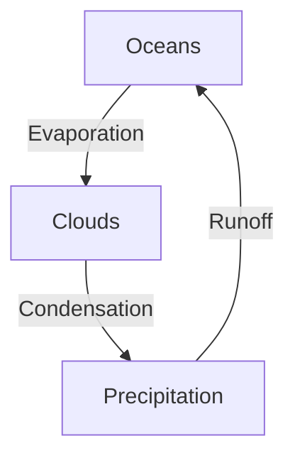

# Edumark

**Writing an educational book should be as simple as writing class notes.**

Edumark is a semantic Markdown extension for creating educational books. The author writes content and marks *what* each thing is — a definition, an exercise, a warning, a mnemonic — without ever deciding how it will look. Presentation is the sole responsibility of the decoder.

File extension: `.edm` — Syntax in English (like Markdown) — Content in any language.

> *[Leer en español](docs/README_ES.md)*

## Why

Existing formats force the author to think about content and presentation at the same time. Word mixes text with formatting. LaTeX demands margins and fonts before the first sentence. HTML is a programming language disguised as a document.

Markdown solved this for plain text: you write content, the renderer decides how it looks. But Markdown doesn't know what a definition is, a learning objective, an exercise with a solution, or a multiple-choice question.

Edumark adds that vocabulary. Nothing more.

> The `.edm` describes **what** the content is, never **how** it looks.

In an Edumark file you will never find colors, margins, fonts, or positioning instructions. The document says "this is a definition" — the decoder decides that definitions are blue boxes with rounded borders. Another decoder makes them green. Another puts them in a tooltip. The same `.edm` works for all of them.

## What it looks like

```
:::definition id="cell"
**Cell** | The structural and functional unit of all living organisms.
:::

:::warning
Do not confuse prokaryotic cells with eukaryotic cells.
The key difference is the presence of a membrane-bound nucleus.
:::

:::exercise title="Cell identification"
Observe the micrograph and determine whether it corresponds to a
prokaryotic or eukaryotic cell. Justify your answer.

:::solution
It is a eukaryotic cell: a defined nucleus with a nuclear membrane,
mitochondria, and endoplasmic reticulum can be observed.
:::
:::
```

## Key features

### Built on CommonMark

Everything that is standard Markdown works. Edumark only adds blocks with `:::` — it redefines nothing.

### 21 pedagogical blocks + inline math

| Block | Purpose |
|---|---|
| `:::objective` | Learning objectives |
| `:::definition` | Term definitions (`**Term** \| Definition`) |
| `:::key-concept` | Core concept to retain |
| `:::note` | Supplementary information |
| `:::warning` | Common errors or warnings |
| `:::example` | Worked example or practical case |
| `:::exercise` | Problem to solve (nests `:::solution`) |
| `:::application` | Theory-to-practice connection |
| `:::comparison` | Comparative table |
| `:::diagram` | Figure: text description + optional Mermaid/D2/DOT/SVG code |
| `:::image` | Image with metadata |
| `:::embed` | External interactive content (3D, video, simulations) |
| `:::question` | Self-assessment with GIFT markers |
| `:::mnemonic` | Mnemonic device |
| `:::history` | Historical context or anecdote |
| `:::summary` | Section/chapter synthesis |
| `:::reference` | Bibliography |
| `:::aside` | Free-form supplementary content |
| `:::teacher-only` | Teacher-only content |
| `:::student-only` | Student-only content |
| `:::math` | Display equation (Unicode, no LaTeX) |

### Questions with GIFT markers

Questions use a syntax inspired by [GIFT](https://docs.moodle.org/en/GIFT_format) (the Moodle format). The correct answer is marked *on the option itself*, not in a separate attribute:

```
:::question type="choice" id="q-force"
What is the SI unit for force?

~ Joule # That's the unit of energy
~ Watt # That's the unit of power
= Newton # Correct — force = mass × acceleration
~ Pascal # That's the unit of pressure
:::
```

| Marker | Meaning |
|---|---|
| `=` | Correct answer (or model answer in open questions) |
| `~` | Distractor (incorrect answer) |
| `#` | Per-option feedback (optional) |

The decoder decides the presentation: in interactive HTML it shows a quiz with feedback on selection; in PDF it creates interactive form fields; in print it generates an answer key at the end.

### Diagrams with fallback

Diagrams accept a text description, code in a diagram language, or both. The decoder renders whatever it supports:

````
:::diagram id="fig-cycle" title="Water cycle"
Circular diagram: evaporation → condensation → precipitation → runoff → evaporation.


:::
````

If the decoder supports Mermaid, it renders the code. If not, it uses the text description as fallback. Also supports D2, Graphviz/DOT, PlantUML, SVG, etc.

### Cross-references

```
ref{id}                    → reference to a block
ref{id visible text}       → with custom text
ref{file.edm#id}           → cross-file
```

Automatic numbering (Figure 1, Table 2) is the decoder's responsibility.

### Book composition

```
::include file="ch01_kinematics.edm"
::include file="ch02_dynamics.edm"
::include file="ch03_energy.edm"
```

A book is assembled from multiple `.edm` files. Includes resolve recursively.

### Conditional content

```
:::teacher-only
Exam answers: 1.c 2.a 3.b
:::

:::student-only
Complete the table with calculated values.
:::
```

The decoder includes or excludes based on compilation mode.

### Formulas without LaTeX

Formulas are written in natural Unicode — no `\frac`, no `$$`, no `\text{}`. The decoder handles rendering:

**Inline** — `m{...}` within text:

```
Velocity is calculated as m{v̄ = Δx/Δt} and is measured in m/s.
```

**Display** — `:::math` block:

```
:::math
v = v₀ + a·t
x = x₀ + v₀·t + ½·a·t²
:::
```

The author writes `v₀` (not `v_0`), `t²` (not `t^2`), `Δx/Δt` (not `\frac{\Delta x}{\Delta t}`). The `.edm` reads as human text, always.

## Official decoder

[**edumark-js**](https://github.com/Debaq/edumark-js) — JavaScript/TypeScript package that parses `.edm` and generates HTML. Works in Node.js and browser:

```bash
npm install github:Debaq/edumark-js
```

```js
import { decode } from 'edumark-js'
const html = decode(edm, { mode: 'student' })
```

Includes an interactive viewer with themes, visual configuration, KaTeX for formulas, and Mermaid for diagrams.

## Visual transformer

[**edumark-beauty**](https://github.com/Debaq/edumark-beauty) — web app to transform `.edm` into beautiful publications. CodeMirror editor, theme configuration with 100+ tokens, export to HTML/PDF/DOCX.

## Generate content with AI

In `llms/` there are ready-made prompts for any LLM to generate complete `.edm` chapters:

| File | Platform |
|---|---|
| `edumark_claude.md` | Claude Code / Projects / API |
| `edumark_universal.md` | ChatGPT, Gemini, Qwen, DeepSeek, Ollama, any other |

Load the prompt as a system prompt, ask for a topic, and the model generates a complete chapter with frontmatter, objectives, structured content, GIFT questions, and bibliography.

## Repository structure

```
edumark/
├── README.md                      ← you are here
├── EDUMARK_SPEC.md                ← full format specification
├── docs/
│   └── README_ES.md               ← Spanish version
├── ejemplos/
│   ├── capitulo_ejemplo.edm       ← physics chapter with all blocks
│   └── U1_01_neurona_celulas_gliales.edm  ← neuroanatomy chapter
└── llms/
    ├── edumark_claude.md
    └── edumark_universal.md
```

## Who is it for

- **Teachers** who write their own handouts, guides, or course textbooks.
- **LLM users** who generate educational material with AI and need a structured, consistent, and reusable format instead of plain text without semantics.
- **Editorial teams** that publish in multiple formats (PDF, web, EPUB, LMS) from a single source.
- **Developers** who want to build decoders, exporters, or tools on top of an open, documented format.

You write content once — by hand or with AI — and publish wherever you want, without being locked into any software.

## Status

Specification v2.0 — stable for use and experimentation.

### Ecosystem

| Repo | Description |
|---|---|
| [edumark](https://github.com/Debaq/edumark) | `.edm` format specification (this repo) |
| [edumark-js](https://github.com/Debaq/edumark-js) | JavaScript/TypeScript decoder |
| [edumark-beauty](https://github.com/Debaq/edumark-beauty) | Visual transformer and exporter |

## License

Open format for educational use.
