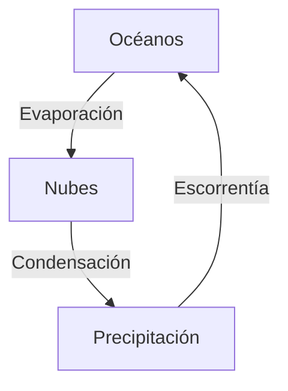

# Edumark

**Escribir un libro educativo debería ser tan simple como escribir un apunte.**

Edumark es una extensión semántica de Markdown para crear libros educativos. El autor escribe contenido y marca *qué* es cada cosa — una definición, un ejercicio, una advertencia, un mnemónico — sin decidir jamás cómo se verá. La presentación es responsabilidad exclusiva del decodificador.

Extensión de archivo: `.edm` — Sintaxis en inglés (como Markdown) — Contenido en cualquier idioma.

> *[Read in English](../README.md)*

## Por qué

Los formatos existentes obligan al autor a pensar en contenido y presentación al mismo tiempo. Word mezcla texto con formato. LaTeX exige márgenes y tipografías antes de la primera oración. HTML es un lenguaje de programación disfrazado de documento.

Markdown resolvió esto para texto plano: escribís contenido, el renderizador decide cómo se ve. Pero Markdown no sabe qué es una definición, un objetivo de aprendizaje, un ejercicio con solución o una pregunta de selección múltiple.

Edumark agrega ese vocabulario. Nada más.

> El `.edm` describe **qué** es el contenido, nunca **cómo** se ve.

En un archivo Edumark nunca vas a encontrar colores, márgenes, tipografías ni instrucciones de posicionamiento. El documento dice "esto es una definición" — el decodificador decide que las definiciones son cajas azules con borde redondeado. Otro decodificador las hace verdes. Otro las pone en un tooltip. El mismo `.edm` sirve para todos.

## Cómo se ve

```
:::definition id="celula"
**Célula** | Unidad estructural y funcional de todos los seres vivos.
:::

:::warning
No confundir célula procariota con eucariota.
La diferencia clave es la presencia de núcleo delimitado por membrana.
:::

:::exercise title="Identificación celular"
Observe la microfotografía y determine si corresponde a una célula
procariota o eucariota. Justifique su respuesta.

:::solution
Es una célula eucariota: se observa un núcleo definido con
membrana nuclear, mitocondrias y retículo endoplásmico.
:::
:::
```

## Características principales

### Construido sobre CommonMark

Todo lo que es Markdown estándar funciona. Edumark solo agrega bloques con `:::` — no redefine nada.

### 21 bloques pedagógicos + math inline

| Bloque | Propósito |
|---|---|
| `:::objective` | Objetivos de aprendizaje |
| `:::definition` | Definición de términos (`**Término** \| Definición`) |
| `:::key-concept` | Concepto fundamental a retener |
| `:::note` | Información complementaria |
| `:::warning` | Errores comunes o advertencias |
| `:::example` | Caso práctico o ejemplo resuelto |
| `:::exercise` | Problema para resolver (anida `:::solution`) |
| `:::application` | Conexión teoría-práctica profesional |
| `:::comparison` | Tabla comparativa |
| `:::diagram` | Figura: descripción textual + código Mermaid/D2/DOT/SVG opcional |
| `:::image` | Imagen con metadatos |
| `:::embed` | Contenido externo interactivo (3D, video, simulaciones) |
| `:::question` | Autoevaluación con marcadores GIFT |
| `:::mnemonic` | Recurso nemotécnico |
| `:::history` | Contexto histórico o anécdota |
| `:::summary` | Síntesis de sección/capítulo |
| `:::reference` | Bibliografía |
| `:::aside` | Contenido complementario libre |
| `:::teacher-only` | Contenido solo para docentes |
| `:::student-only` | Contenido solo para estudiantes |
| `:::math` | Ecuación display (Unicode, sin LaTeX) |

### Preguntas con marcadores GIFT

Las preguntas usan una sintaxis inspirada en [GIFT](https://docs.moodle.org/en/GIFT_format) (el formato de Moodle). La respuesta correcta va marcada *en la opción misma*, no en un atributo separado:

```
:::question type="choice" id="q-fuerza"
¿Cuál es la unidad del SI para la fuerza?

~ Julio # Esa es la unidad de energía
~ Vatio # Esa es la unidad de potencia
= Newton # Correcto — fuerza = masa × aceleración
~ Pascal # Esa es la unidad de presión
:::
```

| Marcador | Significado |
|---|---|
| `=` | Respuesta correcta (o respuesta modelo en preguntas abiertas) |
| `~` | Distractor (respuesta incorrecta) |
| `#` | Feedback por opción (opcional) |

El decodificador decide la presentación: en HTML interactivo muestra un quiz con feedback al responder; en PDF crea campos interactivos; en impresión genera una sección de respuestas al final.

### Diagramas con fallback

Los diagramas aceptan descripción textual, código en un lenguaje de diagramas, o ambos. El decodificador renderiza lo que soporte:

````
:::diagram id="fig-ciclo" title="Ciclo del agua"
Diagrama circular: evaporación → condensación → precipitación → escorrentía → evaporación.


:::
````

Si el decodificador soporta Mermaid, renderiza el código. Si no, usa la descripción textual como fallback. También soporta D2, Graphviz/DOT, PlantUML, SVG, etc.

### Referencias cruzadas

```
ref{id}                    → referencia a un bloque
ref{id texto visible}      → con texto personalizado
ref{archivo.edm#id}        → entre archivos
```

La numeración automática (Figura 1, Tabla 2) la decide el decodificador.

### Composición de libros

```
::include file="cap01_cinematica.edm"
::include file="cap02_dinamica.edm"
::include file="cap03_energia.edm"
```

Un libro se arma desde múltiples `.edm`. Los includes se resuelven recursivamente.

### Contenido condicional

```
:::teacher-only
Respuestas del examen: 1.c 2.a 3.b
:::

:::student-only
Complete la tabla con los valores calculados.
:::
```

El decodificador incluye o excluye según el modo de compilación.

### Fórmulas sin LaTeX

Las fórmulas se escriben en Unicode natural — sin `\frac`, sin `$$`, sin `\text{}`. El decodificador se encarga de renderizarlas bonitas:

**Inline** — `m{...}` dentro del texto:

```
La velocidad se calcula como m{v̄ = Δx/Δt} y se mide en m/s.
```

**Display** — bloque `:::math`:

```
:::math
v = v₀ + a·t
x = x₀ + v₀·t + ½·a·t²
:::
```

El autor escribe `v₀` (no `v_0`), `t²` (no `t^2`), `Δx/Δt` (no `\frac{\Delta x}{\Delta t}`). El `.edm` se lee como texto humano, siempre.

## Decodificador oficial

[**edumark-js**](https://github.com/Debaq/edumark-js) — paquete JavaScript/TypeScript que parsea `.edm` y genera HTML. Funciona en Node.js y browser:

```bash
npm install github:Debaq/edumark-js
```

```js
import { decode } from 'edumark-js'
const html = decode(edm, { mode: 'student' })
```

Incluye un visor interactivo con temas, configuración visual, KaTeX para fórmulas y Mermaid para diagramas.

## Transformador visual

[**edumark-beauty**](https://github.com/Debaq/edumark-beauty) — app web para transformar `.edm` en publicaciones hermosas. Editor CodeMirror, configuración de tema con 100+ tokens, exportación a HTML/PDF/DOCX.

## Generar contenido con IA

En `llms/` hay prompts listos para que cualquier LLM genere capítulos `.edm` completos:

| Archivo | Plataforma |
|---|---|
| `edumark_claude.md` | Claude Code / Projects / API |
| `edumark_universal.md` | ChatGPT, Gemini, Qwen, DeepSeek, Ollama, cualquier otro |

Cargás el prompt como system prompt, le pedís un tema, y el modelo genera un capítulo completo con frontmatter, objetivos, contenido estructurado, preguntas GIFT, y bibliografía.

## Estructura del repositorio

```
edumark/
├── README.md                      ← versión en inglés
├── EDUMARK_SPEC.md                ← especificación completa del formato
├── docs/
│   └── README_ES.md               ← estás aquí
├── ejemplos/
│   ├── capitulo_ejemplo.edm       ← capítulo de física con todos los bloques
│   └── U1_01_neurona_celulas_gliales.edm  ← capítulo de neuroanatomía
└── llms/
    ├── edumark_claude.md
    └── edumark_universal.md
```

## Para quién es

- **Docentes** que escriben sus propios apuntes, guías o libros de cátedra.
- **Usuarios de LLMs** que generan material educativo con IA y necesitan un formato estructurado, consistente y reutilizable en vez de texto plano sin semántica.
- **Equipos editoriales** que publican en múltiples formatos (PDF, web, EPUB, LMS) desde una sola fuente.
- **Desarrolladores** que quieran construir decodificadores, exportadores o herramientas sobre un formato abierto y documentado.

Escribís contenido una vez — a mano o con IA — y lo publicás donde quieras, sin quedar atado a un software.

## Estado

Especificación v2.0 — estable para uso y experimentación.

### Ecosistema

| Repo | Descripción |
|---|---|
| [edumark](https://github.com/Debaq/edumark) | Especificación del formato `.edm` (este repo) |
| [edumark-js](https://github.com/Debaq/edumark-js) | Decoder JavaScript/TypeScript |
| [edumark-beauty](https://github.com/Debaq/edumark-beauty) | Transformador visual y exportador |

## Licencia

Formato abierto para uso educativo.
