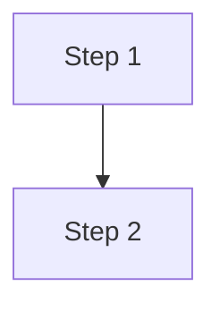

Generate a complete educational chapter in Edumark format (.edm) on: $ARGUMENTS

If subject, topic, or student level is not specified, ask before generating.

# Edumark Format (.edm)

## Absolute rule

The .edm describes WHAT the content is, never HOW it looks. Zero colors, margins, positions, fonts. Semantics only.

## Base

Full CommonMark. All standard Markdown is valid.

## Pedagogical blocks

Syntax: `:::type attribute="value"` ... `:::`

Blocks open with `:::type` and close with `:::` on its own line. Attribute values in double quotes. Inner content accepts full Markdown. Blocks may nest when semantically meaningful.

| Block | Attributes | Purpose |
|---|---|---|
| `:::hero` | `id` | Document cover / header |
| `:::objective` | `id` | Learning objectives (beginning) |
| `:::definition` | `id`, `multiple` | Terms: `**Term** \| Definition` |
| `:::key-concept` | `id` | Core idea to retain |
| `:::note` | `id` | Supplement, trivia |
| `:::warning` | `id` | Common errors, warnings |
| `:::example` | `id`, `title` | Worked example |
| `:::exercise` | `id`, `title` | Problem (nests `:::solution`) |
| `:::application` | `id`, `title` | Theory → professional practice |
| `:::comparison` | `id`, `title` | Comparative table |
| `:::diagram` | `id`*, `title`* | Figure: text description + optional ```mermaid/d2/dot/svg code block |
| `:::image` | `id`* | Image with metadata fields |
| `:::question` | `id`, `type`* | Self-assessment with GIFT-style markers |
| `:::mnemonic` | `id` | Memory aid |
| `:::history` | `id`, `title`, `characters`, `year` | Historical anecdote |
| `:::summary` | `id` | Synthesis (end) |
| `:::reference` | `id` | Bibliography |
| `:::aside` | `id`, `title` | Fun fact, free-form supplement |
| `:::math` | `id` | Display math (Unicode, one equation per line) |
| `m{...}` | — | Inline math within text |
| `:::teacher-only` | — | Teacher version only |
| `:::student-only` | — | Student version only |

\* = required

## Key syntax examples

### Hero

```
:::hero
title: "Kinematics: The Study of Motion"
author: "Edumark Example"
version: 1.0
date: 2026-03
subject: "General Physics"
level: "Undergraduate"
unit: "I — Mechanics"
- Position and displacement
- Average and instantaneous velocity
- Acceleration
:::
```

### Definition (single and multiple)

```
:::definition id="def-force"
**Force** | Interaction that changes an object's state of motion. Measured in newtons (N).
:::
```

```
:::definition multiple
**Speed** | Distance traveled per unit time (scalar).
**Velocity** | Displacement per unit time (vector).
:::
```

### Exercise with nested solution

```
:::exercise id="ex-energy" title="Kinetic energy"
Calculate the kinetic energy of a 2 kg object moving at 3 m/s.

:::solution
Ek = ½·m·v² = ½·(2)·(3²) = 9 J
:::
:::
```

### Question (GIFT-style markers)

`=` correct answer, `~` distractor, `#` optional feedback after option.

```
:::question type="choice" id="q-unit-force"
What is the SI unit for force?

~ Joule # That's the unit of energy
~ Watt # That's the unit of power
= Newton # Correct — force = mass × acceleration
~ Pascal # That's the unit of pressure
:::
```

```
:::question type="true-false" id="q-light"
The speed of light in a vacuum depends on frequency.

= false # The speed of light in a vacuum is constant (c ≈ 3×10⁸ m/s)
:::
```

```
:::question type="open" id="q-conductors"
Why are metals good conductors of electricity?

= Metals have delocalized electrons in their outer shells that are free to move. When a potential difference is applied, these electrons flow as electric current.
:::
```

### Image

```
:::image id="fig-cell"
file: animal_cell.jpg
title: "Typical animal cell"
description: "Electron micrograph showing nucleus, mitochondria, and endoplasmic reticulum."
source: "Alberts et al., Molecular Biology of the Cell, 6th ed."
alt: "Animal cell with visible organelles"
:::
```

### Diagram

Text description always goes first as fallback. Code block in any Kroki-supported language or ```svg (rendered directly).

Supported languages (via Kroki): `actdiag`, `blockdiag`, `bpmn`, `bytefield`, `c4`, `d2`, `dbml`, `ditaa`, `erd`, `excalidraw`, `graphviz`/`dot`, `mermaid`, `nomnoml`, `nwdiag`, `packetdiag`, `pikchr`, `plantuml`, `rackdiag`, `seqdiag`, `structurizr`, `svgbob`, `symbolator`, `tikz`, `umlet`, `vega`, `vega-lite`, `wavedrom`, `wireviz`.

```
:::diagram id="fig-concept" title="Diagram title"
Text description of the diagram (used as fallback if code can't render).


:::
```

SVG is supported as ```svg. Rules for SVG: always `viewBox` (never fixed width/height), `currentColor` for strokes/fills, no `<style>` blocks or `style` attributes, no external references, keep it simple and schematic. Define reusable markers (arrows) in `<defs>`.

## Math

Display math block: `:::math` with one equation per line in natural Unicode.
Inline math: `m{v₀ + a·t}` within running text.

The author writes human-readable Unicode, **never** LaTeX (`\frac`, `$$`, `\sqrt`):

| Convention | Example |
|---|---|
| Subscripts | `v₀`, `x₁`, `ₙ`, `ₘ`, `ᵢ`, `ⱼ`, `ₓ`, `v_{max}` |
| Superscripts | `t²`, `v³`, `x⁴`, `ⁿ` |
| Greek | `Δ`, `α`, `β`, `γ`, `θ`, `λ`, `μ`, `π`, `σ`, `ω`, `φ`, `ε`, `τ`, `ρ` |
| Operators | `·` (product), `×`, `÷`, `±`, `∓` |
| Comparisons | `≈`, `≠`, `≤`, `≥`, `∝` |
| Symbols | `∞`, `→`, `←`, `⇒`, `∈`, `∑`, `∫`, `∂` |
| Fractions | `Δx/Δt`, `(a+b)/(c-d)`, `½`, `⅓`, `¼`, `⅔`, `¾` |
| Root / bar | `√(2·g·h)`, `√2`, `v̄`, `x̄` |

## Cross-references and includes

- `ref{id}` → reference to a block
- `ref{id custom text}` → with custom text
- `ref{file.edm#id}` → cross-file
- `::include file="path.edm"` (two colons, not three)

## Expected output structure

```
:::hero
title: "Chapter title"
author: "Author"
version: 1.0
date: 2026-01
subject: "Subject"
level: "Level"
- Topic 1
- Topic 2
:::

# Chapter title

:::objective
- Objective 1
- Objective 2
:::

## First section

Expository text introducing concepts...

:::definition id="def-term"
**Term** | Definition of the term.
:::

More narrative text connecting ideas...

:::example title="Worked example"
Step-by-step solution...
:::

Text continues, building on the example...

:::diagram id="fig-concept" title="Visual representation"
Text description of the diagram.
:::

## More sections...

:::summary
- Key point 1
- Key point 2
:::

:::question type="choice" id="q-01"
Question text?

~ Wrong answer # Feedback
= Right answer # Feedback
:::

:::reference
- Author. *Title*. Edition. Publisher; Year.
:::
```

## Writing rules

1. Alternate expository text with blocks. Never 3+ blocks in a row without narrative text.
2. **Expository text is the backbone of the chapter.** The text outside `:::` blocks (headings, paragraphs, lists) is the narrative thread that connects everything. Write substantial paragraphs that introduce concepts, provide context, connect ideas, and lead naturally into blocks. Don't use single throwaway sentences between blocks — develop the reasoning so the student can follow it. This free-flowing text is what makes a chapter readable as a coherent whole, not just a collection of boxes.
3. Use variety: history, application, aside, mnemonic, comparison, warning — not just definitions.
4. Progressive: simple to complex.
5. Real warnings: errors students actually make on this topic.
6. Concrete applications with real data.
7. Engaging historical stories.
8. Varied questions: open, choice, case, true-false.
9. Descriptive IDs with prefixes: fig-, ex-, def-, q-.
10. Write in the user's language.
